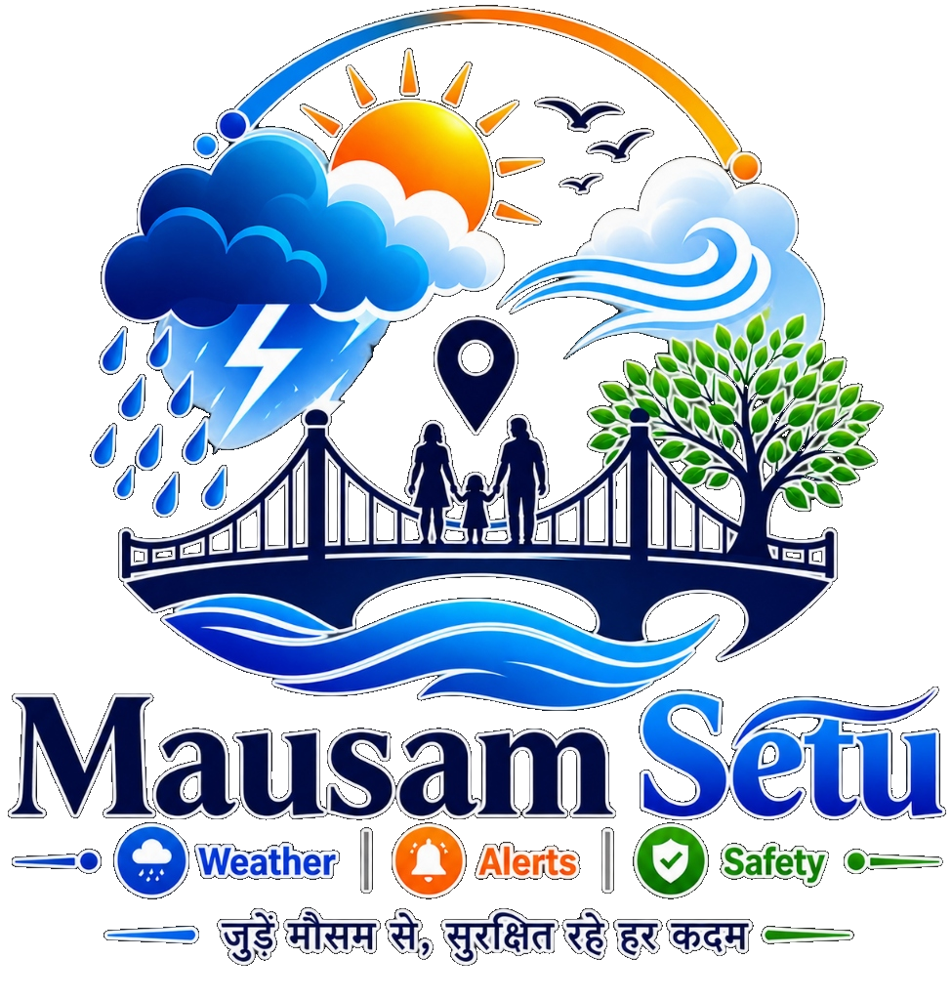

<div align="center">
  
  <h1>Mausam Setu (मौसम सेतु)</h1>
  <p><strong>AI-Powered Weather & Disaster Early-Warning Platform</strong></p>
  <p><em>जुड़ें मौसम से, सुरक्षित रहे हर कदम</em></p>
  <p><strong>SIH 2026 · Problem Statement: SIH26068 · Team CodeSmashers</strong></p>
</div>

---
[](https://sih.gov.in)
[]()
[]()
[]()

> **"Connecting Citizens with Weather, Warnings & Safety"**
>
> Mausam Setu is not just another weather app. It connects:
> **Citizen → GPS Location → Verified Weather Data → AI Weather Assistant → Hazard Detection → Early Warning → Safety Recommendation**

---

## 🎯 Problem Statement

**SIH26068 — WeatherGPT: Conversational AI for Weather Forecasting, Alerts & Climate Information**

Organization: Ministry of Earth Sciences (MoES) / India Meteorological Department (IMD)

The challenge: Indian citizens, especially in rural areas, farmers, and fishing communities, lack accessible, localized, and actionable weather intelligence in their own language.

---

## 🚀 Live Demo

🌐 **[View Live on GitHub Pages](https://YOUR_USERNAME.github.io/mausam-setu)**

### Demo Accounts
| Role | Email | Password |
|------|-------|----------|
| 👤 Citizen | `user@demo.com` | `demo123` |
| 🌾 Farmer | `farmer@demo.com` | `demo123` |
| ⚓ Fisherman | `fish@demo.com` | `demo123` |
| 🛡️ Admin | `admin@mausam.gov` | `admin@sih2026` |

---

## ✨ Features

| Feature | Description |
|---------|-------------|
| 📍 **GPS-Based Alerts** | Location-matched hazard warnings |
| 🤖 **WeatherGPT AI** | Conversational AI answering weather safety questions |
| 🚨 **5-Level Alert System** | WATCH → ADVISORY → WARNING → EMERGENCY |
| 🗺️ **Disaster Map** | Leaflet.js interactive alert zone map |
| 📅 **7-Day Forecast** | Chart.js temperature & rain probability graphs |
| 🌾 **Farmer Mode** | Agricultural weather advisories |
| ⚓ **Fisherman Mode** | GO/NO-GO sea safety dashboard |
| 🇮🇳 **Hindi + English** | Full bilingual support |
| 🛡️ **Safety Engine** | Hazard-specific safety tips (9 hazard types) |
| 🛡️ **Admin Dashboard** | System monitoring, API status, alert table |

---

## 📁 Project Structure

```
mausam-setu/
├── index.html          ← Landing page
├── login.html          ← Authentication
├── dashboard.html      ← Main weather dashboard
├── forecast.html       ← 7-day forecast + charts
├── alerts.html         ← Alert center
├── chat.html           ← WeatherGPT AI chat
├── map.html            ← Disaster map (Leaflet.js)
├── farmer.html         ← Farmer mode
├── fisherman.html      ← Fisherman mode
├── profile.html        ← Settings & notifications
├── admin.html          ← Admin dashboard
├── emergency.html      ← Emergency contacts
├── css/
│   ├── main.css        ← Design system
│   ├── components.css  ← UI components
│   └── pages.css       ← Page-specific styles
└── js/
    ├── config.js       ← Configuration & constants
    ├── utils.js        ← Shared utilities
    ├── translations.js ← EN/Hindi i18n
    ├── auth.js         ← Authentication service
    ├── location.js     ← GPS & location service
    ├── weather.js      ← Weather data service
    ├── alerts.js       ← Alert engine
    ├── safety.js       ← Safety advisory engine
    └── chat.js         ← WeatherGPT AI engine
```

---

## 🛠️ Technology Stack

- **Frontend:** Vanilla HTML5, CSS3, JavaScript (ES6+)
- **Maps:** Leaflet.js v1.9.4 (OpenStreetMap)
- **Charts:** Chart.js v4.4.0
- **i18n:** Custom LangManager (EN + Hindi)
- **Auth:** localStorage-based (demo) | Production-ready adapter pattern
- **Weather API:** Demo mode + OpenWeatherMap/IMD adapter ready
- **Alerts:** Demo database + NDMA API integration architecture
- **Deployment:** GitHub Pages

---

## 📡 Data Sources (Production-Ready Integration)

| Source | Purpose | Status |
|--------|---------|--------|
| [IMD](https://mausam.imd.gov.in) | Official weather & alerts | API adapter ready |
| [NDMA](https://ndma.gov.in) | Disaster warnings | API adapter ready |
| [INCOIS](https://incois.gov.in) | Coastal/marine data | Planned |
| OpenWeatherMap | Fallback weather data | API adapter ready |
| Nominatim | Reverse geocoding | Live |

> ⚠️ **DEMO MODE:** All weather data and alerts in this demo are simulated. The architecture is production-ready for real API integration.

---

## 🚨 Emergency Contacts

| Service | Number |
|---------|--------|
| NDMA Helpline | **1078** |
| National Emergency | **112** |
| Ambulance | **108** |
| Police | **100** |
| Coast Guard | **1554** |
| Flood Control | **1070** |

---

## 🏃 Run Locally

```bash
# Clone the repository
git clone https://github.com/YOUR_USERNAME/mausam-setu.git
cd mausam-setu

# Start local server (Python)
python -m http.server 8080

# Open in browser
# http://localhost:8080
```

---

## 👥 Team CodeSmashers — SIH 2026

Built for **Smart India Hackathon 2026** | Problem ID: **SIH26068**

Category: Disaster Management | Organization: Ministry of Earth Sciences

---

## 📄 License

This project is built for SIH 2026 demonstration purposes.
Official weather data must be sourced from IMD/NDMA for production use.
